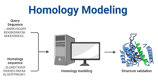
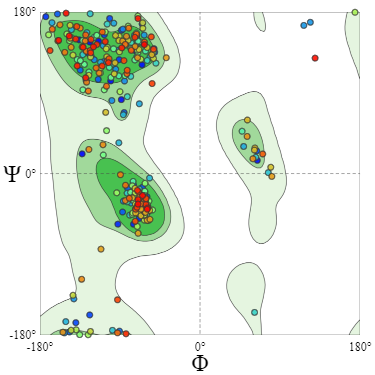

# Practical Comparative Structural Modelling


### Introduction

Welcome to the Homology Modeling Project on GitHub! Our project is dedicated to predicting the three-dimensional structure of α-amylase (AA) from Alteromonas haloplanktis, an enzyme found in Gram-negative bacteria thriving in Antarctica's icy waters, using computational methods. We'll then compare our predictions with experimental X-ray crystallography data.

Homology modelling, also known as comparative modelling, is a method used to predict the 3D structure of a protein with an unknown structure by using the known structure of a homologous protein.

<p align="center">
  
</p>


Throughout this project, we'll follow these essential steps in the homology modelling workflow:

1. Template Selection: Identifying suitable templates from protein structure databases.

2. Pairwise Alignment: Aligning the target α-amylase sequence with selected templates.

3. Model Building: Constructing homology models based on the alignment using modeller.

4. Quality Assessment: Evaluating the quality and reliability of the generated models through various metrics, refining them as necessary for accuracy.

Join us as we delve into the fascinating world of homology modelling and explore the structure-function relationship of α-amylase from Alteromonas haloplanktis. Let's unlock the secrets hidden within protein structures!

### Template Selection :
As mentioned previously, our focus centres on the specific instance of α-amylase (AA) derived from Alteromonas haloplanktis. 

#### 1. Get Protein Sequence 
- To obtain the corresponding protein sequence in FASTA format, we'll utilize the UniProt database, leveraging the unique **accession number P29957**. This will be facilitated through the execution of a shell script named **'download_alpha.sh'** 
#### 2. Remove Signal Peptides :
- Removing signal peptides from a FASTA sequence is a common preprocessing step in bioinformatics and computational biology, when predicting the three-dimensional structure of a protein or conducting homology modelling, including the signal peptide can introduce inaccuracies. Signal peptides are typically cleaved off during protein maturation, so modelling the mature form without the signal peptide is more appropriate.
The location of the signal peptide can be identified in UniProt annotations. Typically, it spans from the beginning of the sequence to a specific position, such as amino acid residues 1 to 24, as indicated in the UniProt annotation [https://doi.org/10.1016/s0021-9258(18)42754-8].

<p align="center">
        
</p>
   


To automate the removal of signal peptides, we'll utilize a shell script named **remove_signal.sh**, which will parse the UniProt annotation to identify the signal peptide's start and end positions. Then, it will extract the mature portion of the protein sequence, excluding the signal peptide. This preprocessing step ensures that subsequent analyses are performed on the mature protein form, free from signal peptides.
the output of the **remove_signal.sh** is our clean sequance target called  **"target.fasta"**
 #### 3.  Search for a homologous protein (template)of our target sequence using BLAST :

 After identifying template candidates, the next step is to select the best structures for homology modelling. While sequence similarity between the template and target sequences is crucial for generating accurate 3D structures, it's not the sole determinant of modelling accuracy. 
#### A.Perform BLAST Search: 
Using the target  clean sequence **"target.fasta"** as a query, conduct a BLAST search against relevant protein databases PDB.

#### B.Identify Template Candidates:
 Review the BLAST results to identify potential template proteins with significant sequence similarity to the target sequence.

#### C.Assess Sequence Similarity:
 While sequence similarity is crucial, it's not the sole determinant of modeling accuracy. A minimum sequence similarity threshold, typically >25%, suggests that the template and target sequences will adopt similar 3D structures.

#### D.Select Template:
 Choose the best template protein based on a combination of sequence similarity, structural quality, and relevance to the target protein's function. In this case, we select chain A of alpha-amylase from Homo sapiens with PDB accession number 1C8Q.

 #### E. Download Template from PDB
 We will use the **download_template.sh** shell script to retrieve template protein structures in PDB format from the Protein Data Bank (PDB). This script streamlines the download process by automating the retrieval of the desired structure based on its PDB ID, which in this case is **1C8Q**. Upon execution, the output file named **1C8Q.pdb** will be available in the designated data directory.
### Pairwise Alignment Between The Target And The Template Sequences :
 #### 1. Clean PDB file of our Template
 In homology modeling, it's important  to clean PDB files by removing water molecules and non-protein atoms to maintain focus on the protein structure. This process ensures that noise, which could interfere with the modeling, is eliminated. We'll achieve this using a shell script named **clean_template_pdb.sh**, and the output will be **1c8q.pdb**in the data directory,After cleaning, it's essential to verify the template with Pymol to ensure the validty  of the structure. 
| 1C8Q.pdb before cleaning | 1c8q.pdb after cleaning           |
|------------------|------------------|
|  |  |

 #### 2. Pairwise Aligment
 The next critical step entails achieving an accurate alignment between the template **1c8q.pdb** and the target sequence **"target.ali**. This alignment is crucial for extracting spatial restraints vital to the modeling process. Using dynamic programming with MODELLER, we conduct pairwise sequence alignment to ensure precision and reliability in our modeling endeavors. This alignment process is encapsulated in a script named **alignment.py**, and the output file will be named **alignment.ali**, located in the data directory.

 ### Building The Homology Modele :
 In addition to the alignment file (alignment.pir) and the template structure **(template.pdb)**, MODELLER necessitates instructions for the modeling process, which are delineated within a Python script file named **build_Modele.py**. Our objective is to produce 10 models of the protein. To commence the modeling process, execute the script using the following command:
  ```sh
 mod10.5 build_Modele.py
 ```
### Quality assessment of the homology model:
 #### 1. Model Selection
 After generating 10 similar models of AMY_PSEHA based on the 1c8q:A template structure, the log file  **build.log** provides a summary of all the models constructed. Each model is listed with its corresponding filename, which contains the coordinates of the model in PDB format, along with its associated scores.

 To select the "best" model, we can consider various criteria. For instance, we may opt for the model with the lowest DOPE score or the highest GA341 assessment score, both of which are presented at the end of the log file **build.log**. In this case, we'll choose the best solution based on the highest GA341 score value.

 The provided command accomplishes this selection process:

 ```sh 
 grep -v 'Filename' build.log | sort -n -k 3 | head -n 1 | awk '{print $1,$4}'")
 ```
 - The model with the highest GA341 score is AMY_PSEHA.B99990007.pdb is the output of the command 

 After choosing this model, we will rename it as **model.pdb**


#### 2. Check stereochemical quality
The overall quality and the individual regions of the a model should
 be assessed. This is an essential part for the correct interpretation of the model.
 The fist step, is to check stereochemical quality by establishing the Ramachandran plot.
 Ramachandran plot can be used for evaluating the accuracy of predicted protein structure. Several tools and servers, such as PDBsum server, MolProbity, STAN Server, and others, are used to generate Ramachandran plot.

  - Submit our selected model to the web server at [https://swissmodel.expasy.org/assess)](https://swissmodel.expasy.org/assess) and we will  check for its stereo chemical validity.
  
 The homology model of the protein, based on the Ramachandran analysis, appears to be of good quality. With approximately 94.16% of residues falling within favored regions and only 1.57% classified as outliers, the majority of the protein structure adopts energetically favorable conformations with minimal deviations in backbone torsion angles. Additionally, the low percentage of rotamer outliers (1.65%) suggests relatively few deviations in side-chain conformations. However, the identification of four residues with C-beta deviations and a few instances of bad bonds and angles indicates areas for potential improvement. Overall, while the model shows promising characteristics, further refinement techniques may be beneficial to address the identified deviations and enhance the accuracy and reliability of the protein structure.
<p align="center">
        
</p>
   


#### 3.  Check The  quality of the model :
 - **Overall model quality** 

 PROSA web server is a tool that predicts the Z-score (overall quality of the protein) and residue wise energy in the plotted form .
  - Submit our selected model to the Prosa web server : [https://prosa.services.came.sbg.ac.at/prosa.php]

  The  Z-score  was  used  for  overall  model  quality sevaluation. Its  value is  displayed in a  plot containing the  Z-score of all experimentally determined protein chains in  the  current PBB.  In  this  plot, the  groups  of  structures 
  from  different  sources  are  distinguished  by  different colours, which can be  used to check whether the  Z-score of  the input  structure is  within  the range  of  the source typically found for the native proteins of similar size. The 
  value of Z-score is highlighted as a black dot in the figure below .
  The Z score value of the obtained model  is -7.93,which falls within the range of those of the PDB native structures.

<p align="center">
  
</p>
 
 - **Local model quality** 
  the amino acids local energy profile plot (figure below)  showed that all the residues across the sequence have negative values  indicating favorable amino acid energy profile, high accuracy and reliability of the model

<p align="center">
  
</p>


#### 4. Algin 3D Model
 To get a view about how powerful the homology modeling is, we will align the 3D model of α-amylase **1AQM** with the experimentally solved structure.
 - Open the model, the crystal and the template structures in a new PyMol session and enter the following commands:
 
 ```sh
select reference, 1AQM and name CA 
select mob_model, model and name CA
align mob_model, reference
```
 - PyMOL uses a two-step approach for aligning structures: first, it performs a sequence alignment, and then it minimizes the Root Mean Square Deviation (RMSD) between the aligned residues. As a result, you will get the structures aligned in the display and something like this will be printed to the console.
 
 
```
PyMOL>align mob_template, reference
 Match: read scoring matrix.
 Match: assigning 447 x 448 pairwise scores.
 MatchAlign: aligning residues (447 vs 448)...
 MatchAlign: score 2421.000
 ExecutiveAlign: 447 atoms aligned.
 ExecutiveRMS: 29 atoms rejected during cycle 1 (RMSD=2.65).
 ExecutiveRMS: 23 atoms rejected during cycle 2 (RMSD=1.28).
 ExecutiveRMS: 14 atoms rejected during cycle 3 (RMSD=0.92).
 ExecutiveRMS: 9 atoms rejected during cycle 4 (RMSD=0.83).
 ExecutiveRMS: 6 atoms rejected during cycle 5 (RMSD=0.79).
 Executive: RMSD =    0.772 (366 to 366 atoms)
 
 ```
The structural alignment showed an RMSD of 0.772 indicating that the model had a very high structural similarity with the crystal structure 1AQM and thus reliable and suitable for the study
<p align="center">
  
</p>


 -In the same manner align the structure of the template with the crystal structure 1AMQ:


 ```sh
select mob_template, 1c8q  and name CA
align mob_template, reference
```


```
 PyMOL>align mob_model, reference
 Match: read scoring matrix.
 Match: assigning 495 x 449 pairwise scores.
 MatchAlign: aligning residues (495 vs 449)...
 MatchAlign: score 1055.500
 ExecutiveAlign: 441 atoms aligned.
 ExecutiveRMS: 33 atoms rejected during cycle 1 (RMSD=2.88).
 ExecutiveRMS: 28 atoms rejected during cycle 2 (RMSD=1.41).
 ExecutiveRMS: 18 atoms rejected during cycle 3 (RMSD=0.87).
 ExecutiveRMS: 15 atoms rejected during cycle 4 (RMSD=0.75).
 ExecutiveRMS: 6 atoms rejected during cycle 5 (RMSD=0.68).
 Executive: RMSD =    0.659 (341 to 341 atoms)
 
 ```
 The RMSD  values obtained from structural alignments provide insights into the similarity between different protein structures. In this case, the RMSD of 0.659 Å between the crystal (real) model and the template suggests a relatively close structural alignment, indicating a high degree of similarity between the two structures. Similarly, the comparative model-template model generated from the template also exhibits a low RMSD of 0.772 Å compared to the crystal structure, indicating a good structural resemblance between the comparative model and the real structure. These low RMSD values suggest that the generated models closely mimic the structure of the template and the real crystal structure. However, it's important to note that even small deviations in RMSD values can indicate differences in local structural details, which may impact functional properties or interactions. Therefore, while the overall alignment appears favorable, further analysis of specific regions and functional implications may be necessary to fully assess the quality and accuracy of the models.

 <p align="center">
  
</p>
                                                      
                                                        
>In conclusion, the project involved various stages of protein structure prediction and analysis, including homology modeling, structural alignment, and quality assessment. Through homology modeling, comparative models were generated based on template structures 1C8Q", providing valuable insights into the 3D structure of the target protein   . Structural alignment with the crystal (real) structure '1AMQ' and template structures revealed low RMSD values, indicating close structural resemblance between the generated models and the real protein structure. Additionally, quality assessment metrics such as Ramachandran plot analysis and Z-score were utilized to evaluate the accuracy and reliability of the models. Overall, the project demonstrated the effectiveness of homology modeling techniques in predicting protein structures and provided valuable information for further research and analysis in structural biology and drug discovery efforts. However, continuous refinement and validation of the models may be necessary to improve their accuracy and reliability for practical applications.


